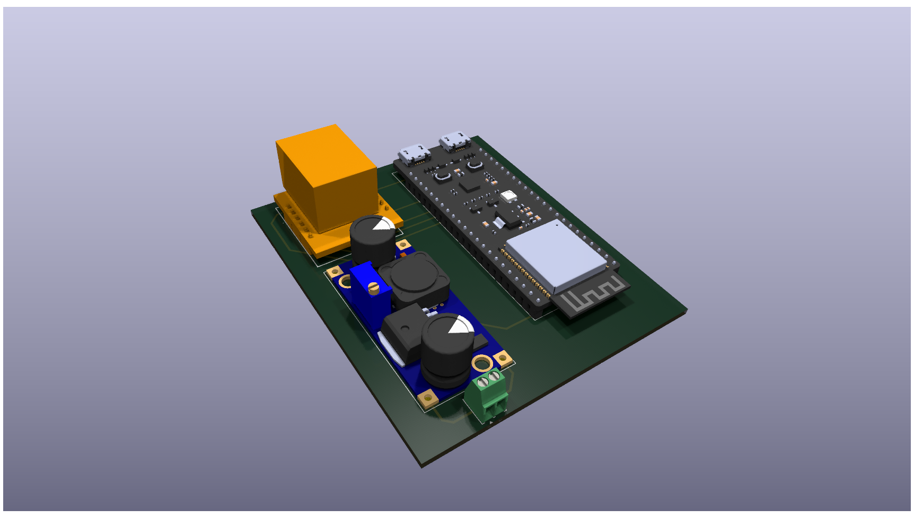

# PBL_Electrical_KiCad

Native KiCad project for the PBL Assembly Station electrical schematic and PCB.

## Preview

## Key files

- `PBL_Electrical.kicad_pro` – KiCad project file (open this in KiCad).
- `PBL_Electrical.kicad_sch` – Schematic sheet.
- `PBL_Electrical.kicad_pcb` – PCB layout.
- `PBL_Electrical.kicad_prl` – KiCad project local settings.
- `PBL_Proj.bak` / `PBL_Proj-sem5.pretty/` / `PBL_Proj.kicad_sym` – Project
  symbol library, custom footprint library, and backups.
- `fp-info-cache`, `fp-lib-table`, `sym-lib-table` – KiCad library tables.
- `PBL_Electrical.png` – Rendered preview of the board/schematic.
- `PBL_Electrical.step` / `PBL_Electrical.wrl` – 3D model exports for CAD.
- `3d.pcb3d` – KiCad 3D viewer cache.
- `PBL_Electrical-backups/` – Automatic KiCad backups.

## How to use

1. Open `PBL_Electrical.kicad_pro` in **KiCad 6+**.
2. Edit the schematic / PCB as needed.
3. Re-export `PBL_Electrical.png` and the 3D models, then update the parent
   `Electrical-Schematics/` images if the wiring changes.