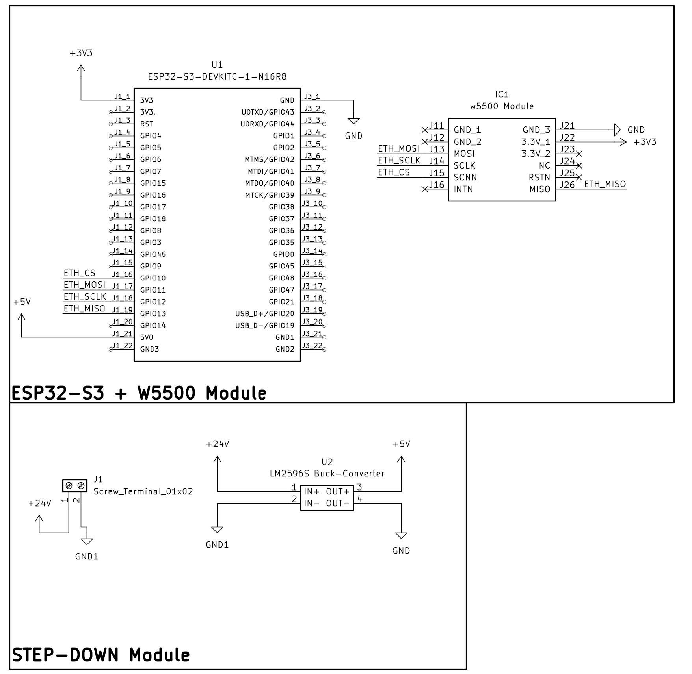

# Electrical-Schematics

This folder holds the electrical documentation for the PBL Assembly Station
control panel. It contains both the source KiCad project (editable) and the
exported/rendered images used in the report and README.

## Preview

## Contents

- `PBL_Electrical.png` – Full rendered schematic/PCB image of the electrical
  wiring (ESP32-S3 + W5500 Ethernet module + PLC I/O + power supply).
- `crop-1.png` – Cropped close-up of a section of the schematic used in
  documentation.
- `PBL_Electrical_KiCad/` – The full KiCad project (schematic, PCB, symbols,
  3D model, footprints). See its own `README.md` for details.

## What it represents

The schematic wires:

- **ESP32-S3 DevKit** to the **W5500** over SPI (CS=10, MOSI=11, SCLK=12,
  MISO=13) for the Modbus TCP Ethernet link to the FX5U PLC.
- Power supply / protection blocks for the ESP32 and the Ethernet module.
- I/O routing between the ESP32 coils and the PLC digital inputs/outputs.

Use this as the wiring reference when assembling or troubleshooting the
hardware. The same pin assignments must match those defined in
`ESP32-Program/src/main.cpp`.