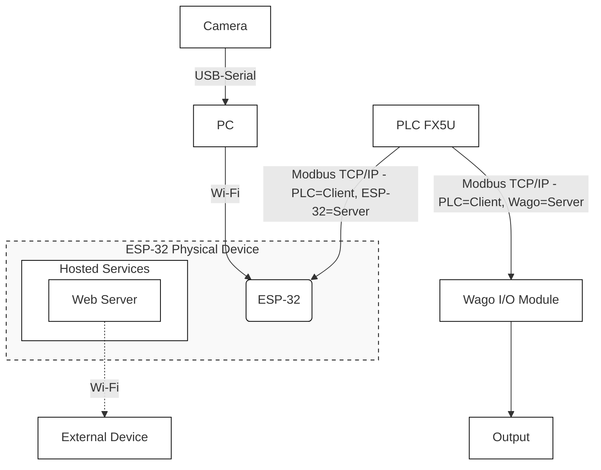
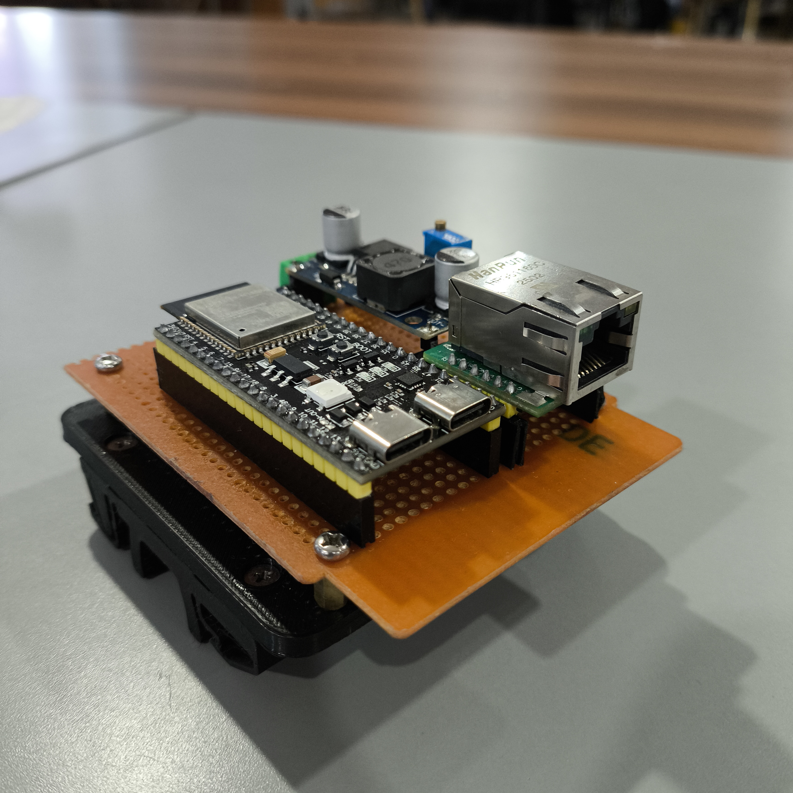
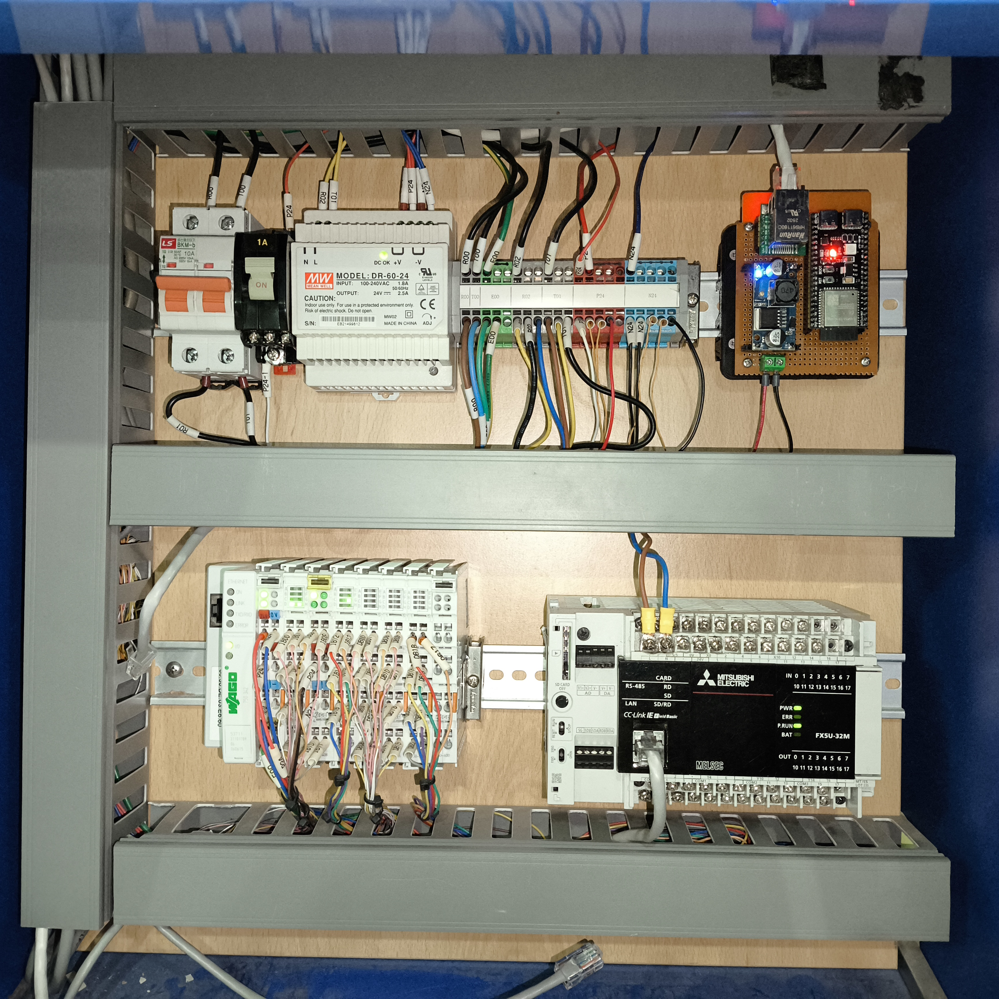

# PBL-MK2025055SB001 - Face Detection & Assembly Station SCADA

Project-Based Learning (PBL) repository for a SCADA prototype built around the
**Assembly Station** at Politeknik Negeri Batam (POLIBATAM). The system uses an
**ESP32** and a **Mitsubishi FX5U PLC** as the main components, communicating
over **Modbus TCP/IP** through a W5500 Ethernet module, with a PC-based face
recognition interface acting as the human-machine interface (HMI) and access
controller.

The main objective is to develop an automatic control & monitoring system for
the Assembly Station that:

- Can be accessed over **Wi-Fi** by external devices (PC, mobile, HMI).
- Talks to the **FX5U PLC** via **Modbus TCP/IP** through the ESP32 (Modbus
  server on port 503).
- Performs **face recognition** on the PC (OpenCV/LBPH) and only allows
  authorized operators to start the machine.
- Provides a web HMI with live video feed, status indicators, and start/stop/
  emergency/reset controls.

## Repository Layout

| Path | Description |
| --- | --- |
| `Electrical-Schematics/` | KiCad project and rendered images of the electrical wiring (ESP32 + W5500 + PLC I/O). |
| `ESP32-Program/` | PlatformIO firmware for the ESP32-S3 (Wi-Fi + Ethernet + Modbus TCP server). |
| `Interface/` | Python (Flask + OpenCV) face-recognition HMI and the web/HTML front-end. |
| `System-Architecture.png` | High-level block diagram of the whole system. |

## System Architecture


## System Overview

1. **Interface (PC)** runs a Flask web app (`Interface/app.py`) that:
   - Captures the webcam feed and detects faces using Haar cascade.
   - Recognizes the operator using an LBPH model (`trainer/trainer.yml`).
   - On authorized detection, sends HTTP commands to the ESP32
     (`/action?type=start|stop|emergency|reset`).
2. **ESP32** (`ESP32-Program/src/main.cpp`) runs two FreeRTOS tasks:
   - **Core 0** – Wi-Fi + WebServer (receives commands from the PC interface).
   - **Core 1** – W5500 Ethernet + Modbus TCP server (port 503) that writes the
     command coils read by the FX5U PLC and reads status coils from the PLC.
3. **Mitsubishi FX5U PLC** is the Modbus TCP client that controls the Assembly
   Station actuators based on the ESP32 coils.

See the [System Architecture](#system-architecture) section for the full block diagram and the per-directory
`README.md` files for component-level details.

## Quick Start

1. Build and flash the firmware with PlatformIO:
   ```bash
   cd ESP32-Program
   pio run -t upload
   ```
2. Train the face model from the PC interface:
   ```bash
   cd Interface
   python 01_Ambil_Wajah.py   # capture dataset
   python 02_training.py      # train -> trainer/trainer.yml
   ```
3. Launch the web HMI:
   ```bash
   python app.py              # http://<PC-IP>:5000
   ```
4. Configure the PLC (FX5U) Modbus TCP client to connect to the ESP32 Ethernet
   IP (`192.168.1.50:503`) and read/write the coils listed in
   `ESP32-Program/src/main.cpp`.

## Finieshed Product & Implementation


